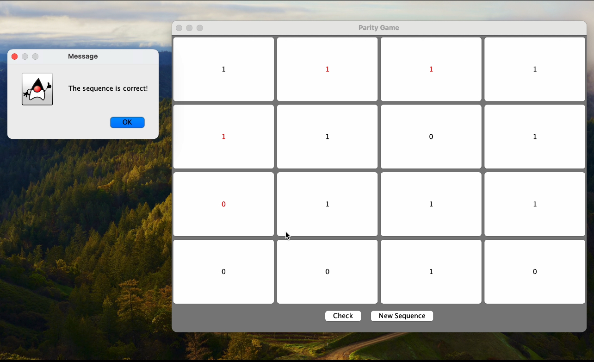

# Hammond Codes 16 Bit Game V1

## Project Overview

The Hammond Codes 16 Bit Game is an interactive application designed to demonstrate and test the principles of Hamming codes, specifically a 16-bit sequence with 4 parity bits. The game involves a grid-based interface where users can flip individual bits to correct errors and verify the accuracy of their sequence based on Hamming code rules. This project is ideal for educational purposes and for anyone interested in understanding error detection and correction in digital communication.

## Scope

### Objective

The primary objective of the Hammond Codes 16 Bit Game is to provide a practical implementation of Hamming codes, focusing on error detection and correction using a 16-bit sequence. Users interact with a 4x4 grid where each cell represents a bit in the sequence. The game introduces a single error into the bit sequence, and users must identify and correct the error using the principles of Hamming codes.

### Key Features

- **16-bit Grid Layout**: The game presents a 4x4 grid where each cell represents a bit of the 16-bit sequence.
- **Hamming Code Implementation**: Utilizes 4 parity bits located at specific indices (1, 2, 4, and 8) to ensure the sequence's integrity.
- **Error Detection**: Checks for errors by verifying parity across odd columns, last two columns, odd rows, and last two rows.
- **Interactive Elements**: Allows users to flip individual bits to correct errors and observe the impact on the overall sequence.
- **Visual Feedback**: Provides visual feedback on the correctness of the sequence by flashing the grid in green for correct sequences and red for incorrect sequences.
- **Error Introduction**: Randomly introduces a single error into the bit sequence for users to detect and correct.



### How It Works

1. **Grid Initialization**: The grid is initialized with a valid 16-bit sequence, where the parity bits are placed at indices 1, 2, 4, and 8. The sequence includes randomly generated data bits and calculated parity bits to ensure even parity.

2. **Error Introduction**: A single error is randomly introduced into one of the data bits (excluding the parity bits) to simulate real-world scenarios of data corruption.

3. **User Interaction**: Users can click on any bit (except the parity bits) to toggle its value between 0 and 1. The goal is to correct the sequence such that all parity checks pass.

4. **Error Checking**: Upon clicking the "Check" button, the game verifies the sequence using the Hamming code's parity checks. It evaluates the parity of odd columns, last two columns, odd rows, and last two rows.

5. **Feedback**: There is a feedback popup that will appear each time you check, if you are incorrect just try again :) or generate new sequence.
## Installation and Usage

1. **Clone the Repository**:
   ```bash
   git clone https://github.com/yourusername/hammond-codes-16-bit-game.git
